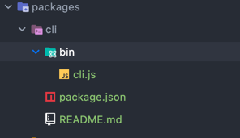

创建文件阶段，构建，集成webpack阶段，运行项目阶段。


## 终端命令行交互

### node 修改 bin
期望像`vue-cli`那样 ，通过自定义的命令行`vue create`，开始创建一个项目，首先能够让程序终端识别我们的自定义指令，我们首先需要修改bin。

比如
```shell
sysuke create
```
希望的终端能够识别sysuke ,然后通过 sysuke create创建一个项目。实际上流程大致是这样的通过sysuke可以指向性执行指定的node文件。接下来我们一起分析一下具体步骤。

执行终端命令号，期望结果是执行当前的node文件。



如上图所示我们在终端执行命令行的时候，统一走bin文件夹下面的 cli.js文件。

cli.js文件

```shell
#!/usr/bin/env node
'use strict';
console.log('hello,world')
```
然后在package.json中声明一下bin。

```json
{
  "name": "@sysuke/cli",
  "version": "1.0.0",
  "description": "",
  "main": "index.ts",
  "bin": {
    "sysuke": "./bin/cli.js"
  }
}
```
为了在本地调试，使用 `pnpm link --global`，一定是在cli项目的目录下跑

然后在任意目录下，运行`sysuke`, 打印`hello,world`即成功。

接下来做的是让node文件(demo项目中的cli.js)能够读懂我们的终端命令。比如说 sysuke create 创建项目； sysuke start运行项目; sysuke build 打包项目；为了能够在终端流利的操纵命令行 ，我们引入 `commander` 模块。

commander -nodejs终端命令行
```shell
pnpm add commander -D
# or
pnpm add commander --filter="@sysuke/cli" -D 
# 为了能在终端打印出花里胡哨的颜色，我们引入chalk库。
pnpm add chalk@4.1.0 -D
pnpm add chalk@4.1.0 --filter="@sysuke/cli" -D 
```

chalk版本问题

https://stackoverflow.com/questions/70309135/chalk-error-err-require-esm-require-of-es-module


接下来需要我们用 commander 来声明的我们终端命令。


inquirer模块命令行交互

```shell
pnpm add inquirer -D
pnpm add inquirer --filter="@sysuke/cli" -D 
```

